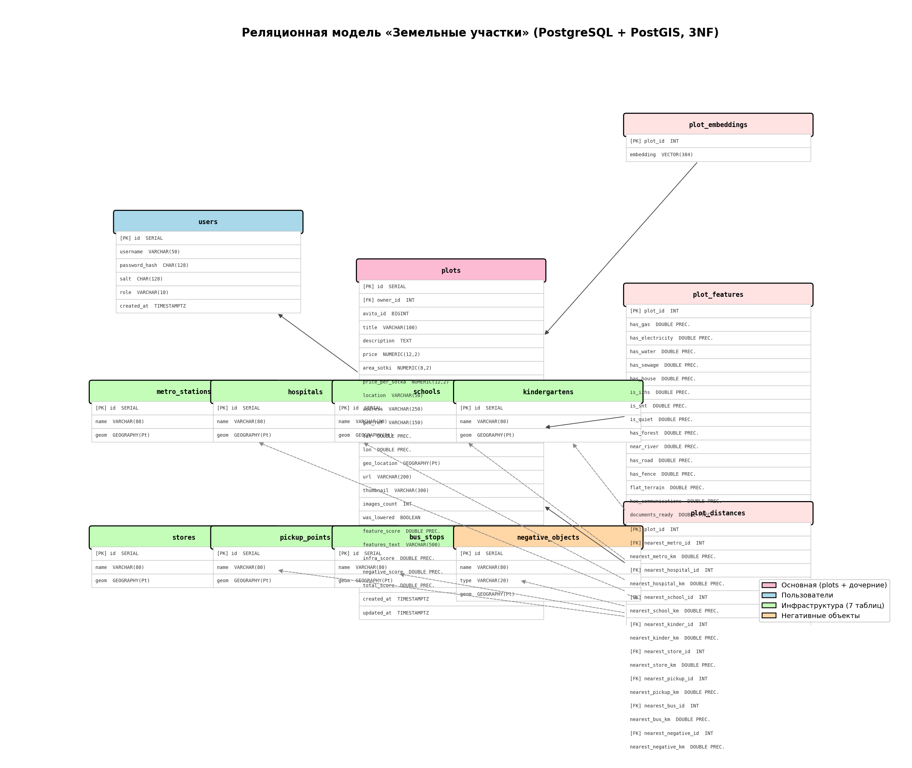

# Модель данных — «Земельные участки» (MongoDB)

> **СУБД:** MongoDB 7.x (документо-ориентированная NoSQL)  
> **База данных:** `land_plots`

---

## 1. Графическое представление модели (ER-диаграмма)

```
┌──────────────────────────────────────────────────────────────────────────┐
│                          БД: land_plots                                 │
└──────────────────────────────────────────────────────────────────────────┘

┌─────────────────────────┐       ┌──────────────────────────────────────┐
│      users              │       │             plots                    │
│─────────────────────────│       │──────────────────────────────────────│
│ _id: ObjectId (PK)      │◄──────│ owner_id: String (FK → users._id)   │
│ username: String (UQ)   │       │ _id: ObjectId (PK)                  │
│ password_hash: String   │       │ avito_id: Int64 (UQ, sparse)        │
│ salt: String            │       │ title: String                       │
│ role: String            │       │ description: String                 │
│ created_at: DateTime    │       │ price: Double                       │
└─────────────────────────┘       │ area_sotki: Double                  │
                                  │ price_per_sotka: Double             │
                                  │ location: String                    │
                                  │ address: String                     │
                                  │ geo_ref: String                     │
                                  │ lat: Double                         │
                                  │ lon: Double                         │
                                  │ geo_location: GeoJSON Point         │
                                  │ url: String                         │
                                  │ thumbnail: String                   │
                                  │ images_count: Int32                 │
                                  │ was_lowered: Boolean                │
                                  │ embedding: Array<Double>[384]       │
                                  │ features: Object{15 полей}          │
                                  │ feature_score: Double               │
                                  │ features_text: String               │
                                  │ distances: Object{8 вложенных}      │
                                  │ infra_score: Double                 │
                                  │ negative_score: Double              │
                                  │ total_score: Double                 │
                                  │ created_at: DateTime                │
                                  │ updated_at: DateTime                │
                                  │ owner_name: String                  │
                                  └──────────────────────────────────────┘
                                           │
                                           │ distances содержит ссылки (по имени)
                                           │ на ближайшие объекты из коллекций ▼
                                           │
    ┌──────────────────┬──────────────────┬─┴────────────────┬──────────────────┐
    ▼                  ▼                  ▼                  ▼                  ▼
┌────────────┐ ┌────────────┐ ┌──────────────┐ ┌────────────┐ ┌────────────────┐
│metro_stations│ │ hospitals  │ │  schools     │ │kindergartens│ │   stores       │
│────────────│ │────────────│ │──────────────│ │────────────│ │────────────────│
│_id: ObjId  │ │_id: ObjId  │ │_id: ObjId    │ │_id: ObjId  │ │_id: ObjId      │
│name: String│ │name: String│ │name: String  │ │name: String│ │name: String    │
│location:   │ │location:   │ │location:     │ │location:   │ │location:       │
│ GeoJSON Pt │ │ GeoJSON Pt │ │ GeoJSON Pt   │ │ GeoJSON Pt │ │ GeoJSON Pt     │
└────────────┘ └────────────┘ └──────────────┘ └────────────┘ └────────────────┘

┌────────────────┐ ┌────────────────┐ ┌────────────────────────┐
│ pickup_points  │ │  bus_stops      │ │  negative_objects      │
│────────────────│ │────────────────│ │────────────────────────│
│ _id: ObjId     │ │ _id: ObjId     │ │ _id: ObjId             │
│ name: String   │ │ name: String   │ │ name: String           │
│ location:      │ │ location:      │ │ type: String           │
│  GeoJSON Pt    │ │  GeoJSON Pt    │ │ location: GeoJSON Pt   │
└────────────────┘ └────────────────┘ └────────────────────────┘
```

### JSON-схема коллекции `plots`

```json
{
  "$jsonSchema": {
    "bsonType": "object",
    "required": ["title", "lat", "lon"],
    "properties": {
      "_id":             { "bsonType": "objectId" },
      "avito_id":        { "bsonType": "long" },
      "title":           { "bsonType": "string", "maxLength": 100 },
      "description":     { "bsonType": "string", "maxLength": 8000 },
      "price":           { "bsonType": "double" },
      "area_sotki":      { "bsonType": "double" },
      "price_per_sotka": { "bsonType": "double" },
      "location":        { "bsonType": "string", "maxLength": 50 },
      "address":         { "bsonType": "string", "maxLength": 250 },
      "geo_ref":         { "bsonType": "string", "maxLength": 150 },
      "lat":             { "bsonType": "double" },
      "lon":             { "bsonType": "double" },
      "geo_location": {
        "bsonType": "object",
        "properties": {
          "type":        { "bsonType": "string", "enum": ["Point"] },
          "coordinates": { "bsonType": "array", "items": { "bsonType": "double" }, "minItems": 2, "maxItems": 2 }
        }
      },
      "url":             { "bsonType": "string", "maxLength": 200 },
      "thumbnail":       { "bsonType": "string", "maxLength": 300 },
      "images_count":    { "bsonType": "int" },
      "was_lowered":     { "bsonType": "bool" },
      "embedding":       { "bsonType": "array", "items": { "bsonType": "double" }, "minItems": 384, "maxItems": 384 },
      "features": {
        "bsonType": "object",
        "properties": {
          "has_gas":            { "bsonType": "double" },
          "has_electricity":    { "bsonType": "double" },
          "has_water":          { "bsonType": "double" },
          "has_sewage":         { "bsonType": "double" },
          "has_house":          { "bsonType": "double" },
          "is_izhs":            { "bsonType": "double" },
          "is_snt":             { "bsonType": "double" },
          "is_quiet":           { "bsonType": "double" },
          "has_forest":         { "bsonType": "double" },
          "near_river":         { "bsonType": "double" },
          "has_road":           { "bsonType": "double" },
          "has_fence":          { "bsonType": "double" },
          "flat_terrain":       { "bsonType": "double" },
          "has_communications": { "bsonType": "double" },
          "documents_ready":    { "bsonType": "double" }
        }
      },
      "feature_score":   { "bsonType": "double" },
      "features_text":   { "bsonType": "string", "maxLength": 500 },
      "distances": {
        "bsonType": "object",
        "properties": {
          "nearest_metro":        { "bsonType": "object", "properties": { "name": {"bsonType":"string"}, "km": {"bsonType":"double"} } },
          "nearest_hospital":     { "bsonType": "object", "properties": { "name": {"bsonType":"string"}, "km": {"bsonType":"double"} } },
          "nearest_school":       { "bsonType": "object", "properties": { "name": {"bsonType":"string"}, "km": {"bsonType":"double"} } },
          "nearest_kindergarten": { "bsonType": "object", "properties": { "name": {"bsonType":"string"}, "km": {"bsonType":"double"} } },
          "nearest_store":        { "bsonType": "object", "properties": { "name": {"bsonType":"string"}, "km": {"bsonType":"double"} } },
          "nearest_pickup_point": { "bsonType": "object", "properties": { "name": {"bsonType":"string"}, "km": {"bsonType":"double"} } },
          "nearest_bus_stop":     { "bsonType": "object", "properties": { "name": {"bsonType":"string"}, "km": {"bsonType":"double"} } },
          "nearest_negative":     { "bsonType": "object", "properties": { "name": {"bsonType":"string"}, "km": {"bsonType":"double"} } }
        }
      },
      "infra_score":     { "bsonType": "double" },
      "negative_score":  { "bsonType": "double" },
      "total_score":     { "bsonType": "double" },
      "created_at":      { "bsonType": "date" },
      "updated_at":      { "bsonType": "date" },
      "owner_id":        { "bsonType": "string" },
      "owner_name":      { "bsonType": "string" }
    }
  }
}
```

### JSON-схема коллекции `users`

```json
{
  "$jsonSchema": {
    "bsonType": "object",
    "required": ["username", "password_hash", "salt", "role"],
    "properties": {
      "_id":           { "bsonType": "objectId" },
      "username":      { "bsonType": "string", "maxLength": 50 },
      "password_hash": { "bsonType": "string", "minLength": 64, "maxLength": 128 },
      "salt":          { "bsonType": "string", "minLength": 64, "maxLength": 128 },
      "role":          { "bsonType": "string", "enum": ["user", "admin"] },
      "created_at":    { "bsonType": "date" }
    }
  }
}
```

### JSON-схема инфраструктурных коллекций (7 шт.)

Общая схема для `metro_stations`, `hospitals`, `schools`, `kindergartens`, `stores`, `pickup_points`, `bus_stops`.

```json
{
  "$jsonSchema": {
    "bsonType": "object",
    "required": ["name", "location"],
    "properties": {
      "_id":  { "bsonType": "objectId" },
      "name": { "bsonType": "string", "maxLength": 80 },
      "location": {
        "bsonType": "object",
        "required": ["type", "coordinates"],
        "properties": {
          "type":        { "bsonType": "string", "enum": ["Point"] },
          "coordinates": {
            "bsonType": "array",
            "items": { "bsonType": "double" },
            "minItems": 2,
            "maxItems": 2,
            "description": "[longitude, latitude]"
          }
        }
      }
    }
  }
}
```

### JSON-схема коллекции `negative_objects`

```json
{
  "$jsonSchema": {
    "bsonType": "object",
    "required": ["name", "type", "location"],
    "properties": {
      "_id":  { "bsonType": "objectId" },
      "name": { "bsonType": "string", "maxLength": 80 },
      "type": { "bsonType": "string", "enum": ["landfill", "industrial", "highway", "sewage_plant", "prison", "power_plant"] },
      "location": {
        "bsonType": "object",
        "required": ["type", "coordinates"],
        "properties": {
          "type":        { "bsonType": "string", "enum": ["Point"] },
          "coordinates": {
            "bsonType": "array",
            "items": { "bsonType": "double" },
            "minItems": 2,
            "maxItems": 2,
            "description": "[longitude, latitude]"
          }
        }
      }
    }
  }
}
```

---

## 2. Описание назначений коллекций, типов данных и сущностей

### 2.1 Коллекция `plots` — объявления о продаже земельных участков

Основная коллекция. Каждый документ — одно объявление с аналитикой.

| Поле | BSON-тип | Среднее (байт) | Макс (байт) | Назначение |
|------|----------|-----:|-----:|-----------|
| `_id` | ObjectId | 12 | 12 | Уникальный идентификатор MongoDB |
| `avito_id` | Int64 | 8 | 8 | ID объявления на Авито (unique sparse) |
| `title` | String | 30 | 57 | Заголовок объявления |
| `description` | String | 1 068 | 6 310 | Полное текстовое описание |
| `price` | Double | 8 | 8 | Цена (₽) |
| `area_sotki` | Double | 8 | 8 | Площадь (сотки) |
| `price_per_sotka` | Double | 8 | 8 | Расчётная цена за сотку |
| `location` | String | 17 | 21 | Район/город (напр. «Петергоф») |
| `address` | String | 90 | 174 | Полный адрес |
| `geo_ref` | String | 23 | 86 | Гео-описание от пайплайна |
| `lat` | Double | 8 | 8 | Широта |
| `lon` | Double | 8 | 8 | Долгота |
| `geo_location` | Object (GeoJSON) | 58 | 58 | `{type:"Point", coordinates:[lon,lat]}` для 2dsphere |
| `url` | String | 100 | 134 | URL оригинального объявления на Авито |
| `thumbnail` | String | 172 | 233 | URL миниатюры изображения |
| `images_count` | Int32 | 4 | 4 | Количество фотографий |
| `was_lowered` | Boolean | 1 | 1 | Была ли снижена цена |
| `embedding` | Array\<Double\>[384] | 3 072 | 3 072 | Вектор sentence-transformers (384 × 8 байт) |
| `features` | Object (15 полей × Double) | 120 | 120 | Вероятностные оценки 15 текстовых характеристик |
| `feature_score` | Double | 8 | 8 | Взвешенная сумма фич |
| `features_text` | String | 194 | 293 | Человекочитаемая строка найденных характеристик |
| `distances` | Object (8 вложенных) | 480 | 480 | Расстояния до 8 типов ближайших инфра-объектов |
| `infra_score` | Double | 8 | 8 | Общий балл инфраструктуры (0–1) |
| `negative_score` | Double | 8 | 8 | Балл удалённости от негативных объектов (0–1) |
| `total_score` | Double | 8 | 8 | Итоговый балл участка (0–1) |
| `created_at` | DateTime | 8 | 8 | Дата создания записи |
| `updated_at` | DateTime | 8 | 8 | Дата обновления |
| `owner_id` | String | 24 | 24 | ID пользователя-владельца |
| `owner_name` | String | 10 | 55 | Имя пользователя-владельца |

**Индексы:** `geo_location` (2dsphere), `avito_id` (unique sparse), `price`, `area_sotki`, `total_score`, `vector_index` (HNSW на `embedding`).

#### Вложенный объект `features`

15 полей типа Double — вероятностные оценки (0.0–1.0) для каждой текстовой характеристики:

| Ключ | Значение | Вес в score |
|------|----------|:-----------:|
| `has_gas` | Подведён газ | 0.25 |
| `has_electricity` | Электричество | 0.20 |
| `has_water` | Водоснабжение | 0.20 |
| `has_sewage` | Канализация / септик | 0.15 |
| `has_house` | Есть дом / постройки | 0.30 |
| `is_izhs` | Категория ИЖС | 0.35 |
| `is_snt` | СНТ / ДНП | 0.10 |
| `is_quiet` | Тихое место | 0.20 |
| `has_forest` | Лес рядом | 0.10 |
| `near_river` | Водоём рядом | 0.10 |
| `has_road` | Хороший подъезд | 0.15 |
| `has_fence` | Огорожен | 0.10 |
| `flat_terrain` | Ровный участок | 0.10 |
| `has_communications` | Все коммуникации | 0.20 |
| `documents_ready` | Документы готовы | 0.15 |

#### Вложенный объект `distances`

8 вложенных объектов `{name: String, km: Double}`:

| Ключ | Источник (коллекция) |
|------|---------------------|
| `nearest_metro` | `metro_stations` |
| `nearest_hospital` | `hospitals` |
| `nearest_school` | `schools` |
| `nearest_kindergarten` | `kindergartens` |
| `nearest_store` | `stores` |
| `nearest_pickup_point` | `pickup_points` |
| `nearest_bus_stop` | `bus_stops` |
| `nearest_negative` | `negative_objects` |

---

### 2.2 Коллекция `users` — пользователи

| Поле | BSON-тип | Размер (байт) | Назначение |
|------|----------|-----:|-----------|
| `_id` | ObjectId | 12 | Уникальный идентификатор |
| `username` | String | ~10 | Логин (unique) |
| `password_hash` | String | 64 | PBKDF2-SHA256 хеш пароля |
| `salt` | String | 64 | Рандомная соль |
| `role` | String | ~5 | Роль: `"user"` или `"admin"` |
| `created_at` | DateTime | 8 | Дата регистрации |

**Среднее:** ~163 байт / документ  
**Индексы:** `username` (unique).

---

### 2.3 Инфраструктурные коллекции (7 шт.)

Семь коллекций с **единой схемой** — точечные объекты инфраструктуры Санкт-Петербурга
и Ленинградской области. Используются при создании / импорте участков для расчёта
`distances` (ближайший объект каждого типа через `$geoNear`).

#### JSON-схема (общая для 7 коллекций)

```json
{
  "$jsonSchema": {
    "bsonType": "object",
    "required": ["name", "location"],
    "properties": {
      "_id":      { "bsonType": "objectId" },
      "name":     { "bsonType": "string", "maxLength": 80 },
      "location": {
        "bsonType": "object",
        "required": ["type", "coordinates"],
        "properties": {
          "type":        { "bsonType": "string", "enum": ["Point"] },
          "coordinates": { "bsonType": "array", "items": { "bsonType": "double" }, "minItems": 2, "maxItems": 2 }
        }
      }
    }
  }
}
```

#### Общая структура полей

| Поле | BSON-тип | Среднее (байт) | Макс (байт) | Назначение |
|------|----------|-----:|-----:|-----------|
| `_id` | ObjectId | 12 | 12 | Уникальный идентификатор MongoDB |
| `name` | String | ~35 | 55 | Название объекта (станция, больница, …) |
| `location` | Object (GeoJSON Point) | 58 | 58 | `{type:"Point", coordinates:[lon,lat]}` для 2dsphere |
| **BSON-оверхед** | — | ~25 | ~30 | Ключи полей, типы, длины строк |
| **Итого** | | **~130** | **~155** | |

**Индексы:** `location` (2dsphere), `name` (B-tree).

#### Детальная характеристика каждой коллекции

##### 2.3.1 `metro_stations` — станции метрополитена

Ближайшие станции метро — ключевой фактор транспортной доступности.
Влияние на `infra_score`: **вес наивысший** среди инфраструктуры (до ~30 км считается
«зона метро»).

| Параметр | Значение |
|----------|---------|
| Кол-во объектов | **15** |
| Средняя длина `name` | 15 символов (30 байт UTF-8) |
| Географический охват | СПб: от «Проспект Ветеранов» (юг) до «Парнас» (север) |
| Координатный диапазон | lat: 59.83–60.07, lon: 30.25–30.51 |
| Пример | `Проспект Ветеранов` [30.2501, 59.8418] |

##### 2.3.2 `hospitals` — больницы и медицинские учреждения

Ближайшая больница — важный фактор безопасности и инфраструктурной оценки.

| Параметр | Значение |
|----------|---------|
| Кол-во объектов | **9** |
| Средняя длина `name` | 24 символа (48 байт UTF-8 с кириллицей) |
| Географический охват | СПб + Ломоносов, Всеволожск, Гатчина, Сестрорецк, Тосно |
| Координатный диапазон | lat: 59.54–60.10, lon: 29.77–30.88 |
| Пример | `Александровская больница` [30.3894, 59.8663] |

##### 2.3.3 `schools` — школы

Близость к школам важна для семей; влияет на `infra_score`.

| Параметр | Значение |
|----------|---------|
| Кол-во объектов | **10** |
| Средняя длина `name` | 18 символов |
| Географический охват | Красное Село, Пушкин, Колпино, Всеволожск, Гатчина, Петергоф, Сестрорецк, Ломоносов, Тосно, Кировск |
| Координатный диапазон | lat: 59.54–60.09, lon: 29.77–30.99 |
| Пример | `Школа №1 Красное Село` [30.0849, 59.7382] |

##### 2.3.4 `kindergartens` — детские сады

| Параметр | Значение |
|----------|---------|
| Кол-во объектов | **8** |
| Средняя длина `name` | 27 символов |
| Географический охват | Красное Село, Пушкин, Колпино, Всеволожск, Гатчина, Петергоф, Сестрорецк, Ломоносов |
| Координатный диапазон | lat: 59.57–60.10, lon: 29.78–30.65 |
| Пример | `Детский сад №10 Красное Село` [30.0900, 59.7350] |

##### 2.3.5 `stores` — продуктовые магазины и супермаркеты

Близость к магазинам — базовый бытовой фактор.

| Параметр | Значение |
|----------|---------|
| Кол-во объектов | **10** |
| Средняя длина `name` | 20 символов |
| Географический охват | Красное Село, Пушкин, Колпино, Всеволожск, Гатчина, Петергоф, Сестрорецк, Девяткино, Парнас, Пулково |
| Координатный диапазон | lat: 59.57–60.09, lon: 29.91–30.65 |
| Пример | `Лента Колпино` [30.5900, 59.7510] |

##### 2.3.6 `pickup_points` — пункты выдачи заказов

Озон, Wildberries, Яндекс.Маркет — актуальная инфраструктура для загородных участков.

| Параметр | Значение |
|----------|---------|
| Кол-во объектов | **9** |
| Средняя длина `name` | 22 символа |
| Географический охват | Красное Село, Пушкин, Колпино, Всеволожск, Гатчина, Петергоф, Сестрорецк, Девяткино, Парнас |
| Координатный диапазон | lat: 59.57–60.07, lon: 29.91–30.65 |
| Пример | `Wildberries Пушкин` [30.3980, 59.7150] |

##### 2.3.7 `bus_stops` — автобусные остановки

Наземный общественный транспорт — особенно важен в пригородах, удалённых от метро.

| Параметр | Значение |
|----------|---------|
| Кол-во объектов | **12** |
| Средняя длина `name` | 27 символов |
| Географический охват | Красное Село, Пушкин, Колпино, Всеволожск, Гатчина, Петергоф, Сестрорецк, Ломоносов, Токсово, Зеленогорск, Мга, Кировск |
| Координатный диапазон | lat: 59.57–60.20, lon: 29.70–31.05 |
| Пример | `Остановка Зеленогорск вокзал` [29.6989, 60.1956] |

#### Сводная таблица инфра-коллекций

| Коллекция | Кол-во | Средн. `name` (байт) | Средн. документ (байт) | Суммарно (байт) | Роль в `distances` |
|-----------|:------:|:-----:|:------:|:------:|---------------------|
| `metro_stations` | 15 | 30 | 125 | 1 875 | `nearest_metro` |
| `hospitals` | 9 | 48 | 143 | 1 287 | `nearest_hospital` |
| `schools` | 10 | 36 | 131 | 1 310 | `nearest_school` |
| `kindergartens` | 8 | 54 | 149 | 1 192 | `nearest_kindergarten` |
| `stores` | 10 | 40 | 135 | 1 350 | `nearest_store` |
| `pickup_points` | 9 | 44 | 139 | 1 251 | `nearest_pickup_point` |
| `bus_stops` | 12 | 54 | 149 | 1 788 | `nearest_bus_stop` |
| **Итого (7 колл.)** | **73** | — | **~139** | **~10 053** | |

---

### 2.4 Коллекция `negative_objects` — негативные объекты окружения

Объекты, **снижающие** привлекательность участка: свалки, промзоны, шумные магистрали,
очистные сооружения, исправительные учреждения, ТЭЦ. Чем **дальше** ближайший
негативный объект — тем **выше** `negative_score`.

#### JSON-схема

```json
{
  "$jsonSchema": {
    "bsonType": "object",
    "required": ["name", "type", "location"],
    "properties": {
      "_id":      { "bsonType": "objectId" },
      "name":     { "bsonType": "string", "maxLength": 80 },
      "type":     { "bsonType": "string", "enum": ["landfill", "industrial", "highway", "sewage_plant", "prison", "power_plant"] },
      "location": {
        "bsonType": "object",
        "required": ["type", "coordinates"],
        "properties": {
          "type":        { "bsonType": "string", "enum": ["Point"] },
          "coordinates": { "bsonType": "array", "items": { "bsonType": "double" }, "minItems": 2, "maxItems": 2 }
        }
      }
    }
  }
}
```

#### Поля

| Поле | BSON-тип | Среднее (байт) | Макс (байт) | Назначение |
|------|----------|-----:|-----:|-----------|
| `_id` | ObjectId | 12 | 12 | Уникальный идентификатор |
| `name` | String | ~35 | 55 | Человекочитаемое название |
| `type` | String | ~12 | 14 | Категория негативного объекта |
| `location` | Object (GeoJSON Point) | 58 | 58 | Координаты для `$geoNear` |
| **BSON-оверхед** | — | ~30 | ~35 | Ключи, типы, длины |
| **Итого** | | **~147** | **~174** | |

**Индексы:** `location` (2dsphere), `name` (B-tree).

#### Классификация по типам

| `type` | Кол-во | Описание | Примеры |
|--------|:------:|----------|---------|
| `landfill` | 3 | Свалки, полигоны ТБО | Новосёлки, Красный Бор, Новый Свет |
| `industrial` | 5 | Промышленные зоны | Обухово, Металлострой, Парнас, Кировский, Шушары |
| `highway` | 2 | Шумные магистрали (КАД) | КАД южный, КАД северный |
| `sewage_plant` | 1 | Очистные сооружения | Очистные Красное Село |
| `prison` | 2 | Исправительные учреждения | ИК-6 Обухово, СИЗО-1 Кресты |
| `power_plant` | 1 | Электростанции / ТЭЦ | ТЭЦ Южная |
| **Итого** | **14** | | |

#### Географический охват

| Параметр | Значение |
|----------|---------|
| Координатный диапазон | lat: 59.67–60.09, lon: 30.06–30.73 |
| Зона покрытия | Юг СПб (Красный Бор), запад (Красное Село), север (Парнас/Новосёлки), восток (Металлострой) |

#### Связь с `plots.distances`

При создании / импорте участка выполняется `$geoNear` к `negative_objects`:

```javascript
db.negative_objects.aggregate([
  { $geoNear: { near: { type: "Point", coordinates: [lon, lat] }, distanceField: "dist_meters", spherical: true } },
  { $limit: 1 },
  { $project: { name: 1, dist_meters: 1 } }
])
```

Результат записывается в `plots.distances.nearest_negative` → `{name, km}`.
Далее из `km` рассчитывается `negative_score` (0–1): чем больше расстояние — тем выше балл.

---

## 3. Оценка объёма информации

### 3.1 Размер одного документа `plots`

Оценим **средний** размер документа `plots` по реальным данным (2174 записи):

| Группа полей | Среднее (байт) | Комментарий |
|-------------|------:|-----------|
| Служебное: `_id`, `avito_id` | 20 | ObjectId + Int64 |
| Текст: `title`, `description`, `location`, `address`, `geo_ref` | 1 228 | UTF-8, среднее по данным |
| Числовые: `price`, `area_sotki`, `price_per_sotka`, `lat`, `lon` | 40 | 5 × Double |
| Гео: `geo_location` | 58 | GeoJSON Point |
| Медиа: `url`, `thumbnail`, `images_count`, `was_lowered` | 277 | |
| Вектор: `embedding` | 3 072 | 384 × 8 байт |
| Фичи: `features` (15 × Double) + `feature_score` + `features_text` | 322 | 120 + 8 + 194 |
| Расстояния: `distances` (8 × {name, km}) | 480 | ~60 байт × 8 |
| Скоры: `infra_score`, `negative_score`, `total_score` | 24 | 3 × Double |
| Мета: `created_at`, `updated_at`, `owner_id`, `owner_name` | 50 | |
| **BSON-оверхед** (ключи полей, типы, длины) | ~450 | ~30 полей верхнего уровня + вложенные |
| **Итого средний документ** | **~6 021** | |

Обозначим **N** — количество объявлений (plots).

Размер коллекции `plots`:

$$S_{\text{plots}}(N) = 6\,021 \times N \;\text{(байт)} \approx 5.88 \times N \;\text{(КБ)}$$

### 3.2 Размеры инфра-коллекций

Обозначим число объектов инфраструктуры каждого типа как $I_j$ ($j = 1 \ldots 8$), и суммарное $I = \sum_{j=1}^{8} I_j$.

#### 3.2.1 Инфраструктурные коллекции (7 шт.)

Средний размер документа (с BSON-оверхедом) ≈ **139 байт** (от 125 для `metro_stations` до 149 для `kindergartens` / `bus_stops`).

| Коллекция | Кол-во | Средн. документ (байт) | Суммарно (байт) |
|-----------|:------:|:------:|:------:|
| `metro_stations` | 15 | 125 | 1 875 |
| `hospitals` | 9 | 143 | 1 287 |
| `schools` | 10 | 131 | 1 310 |
| `kindergartens` | 8 | 149 | 1 192 |
| `stores` | 10 | 135 | 1 350 |
| `pickup_points` | 9 | 139 | 1 251 |
| `bus_stops` | 12 | 149 | 1 788 |
| **Итого (7 колл.)** | **73** | **~139** | **~10 053** |

#### 3.2.2 Коллекция `negative_objects`

Средний размер документа ≈ **147 байт** (дополнительное поле `type`).

| Коллекция | Кол-во | Средн. документ (байт) | Суммарно (байт) |
|-----------|:------:|:------:|:------:|
| `negative_objects` | 14 | 147 | 2 058 |

#### 3.2.3 Общий объём инфраструктуры

$$S_{\text{infra}}(I) \approx 140 \times I \;\text{(байт)}$$

Текущие количества: $I = 73 + 14 = 87$ объектов → **~12 111 байт (~11.8 КБ)**.

### 3.3 Размер коллекции `users`

Обозначим $U$ — количество пользователей. Средний документ ≈ **163 байт**.

$$S_{\text{users}}(U) = 163 \times U \;\text{(байт)}$$

### 3.4 Индексы

MongoDB создаёт B-tree (и 2dsphere, HNSW) индексы. Оценка размера индексов для `plots`:

| Индекс | Оценка (байт/запись) |
|--------|-----:|
| `_id` (B-tree) | ~40 |
| `avito_id` (unique sparse) | ~40 |
| `price` | ~40 |
| `area_sotki` | ~40 |
| `total_score` | ~40 |
| `geo_location` (2dsphere) | ~200 |
| `vector_index` (HNSW, 384-dim) | ~3 200 |
| **Итого индексы plots** | **~3 600** |

$$S_{\text{idx\_plots}}(N) = 3\,600 \times N$$

Индексы инфра (2 × B-tree + 2dsphere на каждую) ≈ 280 байт × I.

### 3.5 Общая формула объёма

$$\boxed{S_{\text{total}}(N) = 9\,621 \times N + 410 \times I + 203 \times U \;\;\text{(байт)}}$$

При фиксированных $I = 87$, $U = 10$:

$$S_{\text{total}}(N) \approx 9\,621 N + 37\,700 \;\;\text{(байт)}$$

**Пример:** При $N = 2\,174$ (текущие данные):
- plots + индексы: 2 174 × 9 621 ≈ **20.0 МБ**
- infra + индексы: 87 × 410 ≈ **34.8 КБ**
- users: 10 × 203 ≈ **2.0 КБ**
- **Общий объём: ≈ 20.0 МБ**

---

## 4. Избыточность модели

### 4.1 «Чистый» объём данных

«Чистые» данные — это поля, непосредственно описывающие участок (без аналитических, без вектора, без BSON-оверхеда):

| Поле / группа | Среднее (байт) |
|---------------|------:|
| `avito_id` | 8 |
| `title`, `description`, `location`, `address`, `geo_ref` | 1 228 |
| `price`, `area_sotki`, `lat`, `lon` | 32 |
| `url`, `thumbnail`, `images_count`, `was_lowered` | 277 |
| `created_at` | 8 |
| **Итого «чистый» документ** | **~1 553** |

«Производные» (аналитические) данные, **рассчитываемые автоматически**:

| Группа | Среднее (байт) | Назначение |
|--------|------:|-----------|
| `embedding` (384 × 8) | 3 072 | Вектор для поиска |
| `features` (15 × Double) | 120 | Оценки фич |
| `feature_score`, `features_text` | 202 | Агрегаты фич |
| `distances` (8 объектов) | 480 | Кэш расстояний |
| `price_per_sotka`, `infra_score`, `negative_score`, `total_score` | 32 | Скоры |
| `geo_location` | 58 | Дубль lat/lon для 2dsphere |
| `owner_id`, `owner_name` | 34 | Денормализация пользователя |
| **Итого производных** | **~3 998** |

BSON-оверхед ≈ **470 байт** (ключи, типы, вложенные структуры).

### 4.2 Формула избыточности

Избыточность $R$ — отношение фактического объёма к «чистому» объёму данных:

$$R = \frac{S_{\text{total}}(N)}{S_{\text{clean}}(N)} = \frac{9\,621 \times N + 410 \times I + 203 \times U}{1\,553 \times N}$$

При фиксированных $I = 87$, $U = 10$:

$$\boxed{R(N) = \frac{9\,621 N + 37\,700}{1\,553 N} = 6.20 + \frac{24.3}{N}}$$

| N | R (коэффициент избыточности) |
|---|---|
| 100 | 6.44 |
| 1 000 | 6.22 |
| 2 174 | 6.21 |
| 10 000 | 6.20 |

**При больших N избыточность стремится к ≈ 6.2×.**

Основной вклад в избыточность:
1. **Embedding-вектор** (384 × 8 = 3 072 байт) — 51% от «производных» данных
2. **Кэш расстояний** (480 байт) — денормализация из инфра-коллекций
3. **BSON-оверхед** (~470 байт) — хранение имён полей в каждом документе

Эта избыточность оправдана: embedding обязателен для семантического поиска, кэш расстояний исключает повторные `$geoNear`-запросы при чтении.

---

## 5. Направление роста модели

| Сущность | При увеличении | Влияние на модель |
|----------|---------------|-------------------|
| **Plots (N)** | Самый быстрый рост | Линейный рост ~9.6 КБ/документ. При N = 100 000 → ~920 МБ. Основной драйвер — embedding-вектор (3 КБ) и description (1 КБ). Индекс HNSW растёт O(N log N). |
| **Инфраструктура (I)** | Медленный рост | ~130 байт/объект. Рост незначителен. Увеличение I не влияет на plots, но при пересчёте расстояний время `$geoNear` растёт логарифмически (благодаря 2dsphere-индексу). |
| **Users (U)** | Минимальный рост | ~163 байт/пользователь. Влияние несущественно при любых реалистичных U. |
| **Вложенные объекты в plots** | Фиксировано | `features` (15 полей), `distances` (8 объектов) — фиксированная структура, не растёт. |

**Главный вектор роста — N (количество объявлений).** Инфраструктура и пользователи растут на порядки медленнее.

При масштабировании рекомендуется:
- При N > 50 000: шардирование коллекции `plots` по `geo_location` (range по `lat`)
- При N > 100 000: вынос embedding в отдельную коллекцию для уменьшения рабочего набора RAM

---

## 6. Примеры хранения данных в БД

### 6.1 Пример документа `plots`

```json
{
  "_id": ObjectId("682fc1a5e3b7f2001a4d52c1"),
  "avito_id": 7547791865,
  "title": "Участок 4 сот. (СНТ, ДНП)",
  "description": "Продается участок 4 сотки.\n\nУчасток правильной квадратной формы, разработан. Есть плодовые деревья, цветы, кустарники (крыжовник, смородина, малина). На территории участка находятся теплица и парник, сарай для хранения инвентаря и еврокуб. Есть летний водопровод. Есть отдельный погребок. Тихое и уютное место, достойные соседи...",
  "price": 1400000,
  "area_sotki": 4.0,
  "price_per_sotka": 350000.0,
  "location": "Петергоф",
  "address": "Ленинградская область, Ломоносовский район, деревня Низино, садоводческое некоммерческое товарищество Сад-2",
  "geo_ref": "д. Низино, садоводческое некоммерческое товарищество Сад-2",
  "lat": 59.837417,
  "lon": 29.884385,
  "geo_location": {
    "type": "Point",
    "coordinates": [29.884385, 59.837417]
  },
  "url": "https://www.avito.ru/sankt-peterburg_peterhof/zemelnye_uchastki/uchastok_4_sot._snt_dnp_7547791865",
  "thumbnail": "https://00.img.avito.st/image/1/1.wPJgw7a-bBsWba4UbIikzgFibh3SdGgb0hMNEd6gY9nbYG4...",
  "images_count": 13,
  "was_lowered": false,
  "embedding": [0.1199, -0.0170, 0.0054, -0.0320, ...],  // 384 float64
  "features": {
    "has_gas": 0.3752,
    "has_electricity": 0.3212,
    "has_water": 0.5228,
    "has_sewage": 0.4943,
    "has_house": 0.5357,
    "is_izhs": 0.3684,
    "is_snt": 0.3613,
    "is_quiet": 0.5999,
    "has_forest": 0.4556,
    "near_river": 0.4559,
    "has_road": 0.4874,
    "has_fence": 0.3033,
    "flat_terrain": 0.2769,
    "has_communications": 0.2187,
    "documents_ready": 0.1435
  },
  "feature_score": 1.0701,
  "features_text": "тихое место (60%), дом/постройки (54%), водоснабжение (52%), канализация (49%), хороший подъезд (49%), водоём рядом (46%)...",
  "distances": {
    "nearest_metro": { "name": "Проспект Ветеранов", "km": 8.45 },
    "nearest_hospital": { "name": "Ломоносовская больница", "km": 3.21 },
    "nearest_school": { "name": "Школа №6 Петергоф", "km": 2.15 },
    "nearest_kindergarten": { "name": "Детский сад №5 Петергоф", "km": 1.92 },
    "nearest_store": { "name": "Дикси Петергоф", "km": 1.88 },
    "nearest_pickup_point": { "name": "Ozon Петергоф", "km": 2.01 },
    "nearest_bus_stop": { "name": "Остановка Петергоф фонтаны", "km": 1.76 },
    "nearest_negative": { "name": "Очистные Красное Село", "km": 5.32 }
  },
  "infra_score": 0.1842,
  "negative_score": 0.2472,
  "total_score": 0.3521,
  "created_at": ISODate("2026-03-01T14:02:33Z"),
  "updated_at": null,
  "owner_id": null,
  "owner_name": null
}
```

### 6.2 Примеры документов инфраструктуры

**metro_stations:**
```json
{
  "_id": ObjectId("682fc1a5e3b7f2001a4d5001"),
  "name": "Проспект Ветеранов",
  "location": {
    "type": "Point",
    "coordinates": [30.2501, 59.8418]
  }
}
```

**hospitals:**
```json
{
  "_id": ObjectId("682fc1a5e3b7f2001a4d5010"),
  "name": "Александровская больница",
  "location": {
    "type": "Point",
    "coordinates": [30.3894, 59.8663]
  }
}
```

**schools:**
```json
{
  "_id": ObjectId("682fc1a5e3b7f2001a4d5020"),
  "name": "Школа №1 Красное Село",
  "location": {
    "type": "Point",
    "coordinates": [30.0849, 59.7382]
  }
}
```

**kindergartens:**
```json
{
  "_id": ObjectId("682fc1a5e3b7f2001a4d5030"),
  "name": "Детский сад №10 Красное Село",
  "location": {
    "type": "Point",
    "coordinates": [30.0900, 59.7350]
  }
}
```

**stores:**
```json
{
  "_id": ObjectId("682fc1a5e3b7f2001a4d5035"),
  "name": "Лента Колпино",
  "location": {
    "type": "Point",
    "coordinates": [30.5900, 59.7510]
  }
}
```

**pickup_points:**
```json
{
  "_id": ObjectId("682fc1a5e3b7f2001a4d5040"),
  "name": "Wildberries Пушкин",
  "location": {
    "type": "Point",
    "coordinates": [30.3980, 59.7150]
  }
}
```

**bus_stops:**
```json
{
  "_id": ObjectId("682fc1a5e3b7f2001a4d5045"),
  "name": "Остановка Зеленогорск вокзал",
  "location": {
    "type": "Point",
    "coordinates": [29.6989, 60.1956]
  }
}
```

**negative_objects:**
```json
{
  "_id": ObjectId("682fc1a5e3b7f2001a4d5050"),
  "name": "Полигон Новосёлки",
  "type": "landfill",
  "location": {
    "type": "Point",
    "coordinates": [30.2188, 60.0872]
  }
}
```

**users:**
```json
{
  "_id": ObjectId("682fc1a5e3b7f2001a4d5100"),
  "username": "admin",
  "password_hash": "a1b2c3d4e5f6...64 hex chars",
  "salt": "f6e5d4c3b2a1...64 hex chars",
  "role": "admin",
  "created_at": ISODate("2026-03-01T14:02:33Z")
}
```

---

## 7. Примеры запросов к модели

### 7.1 Текст запросов

#### Q1. Постраничный просмотр каталога (UC1, UC2, UC3)

```javascript
// Подсчёт количества для пагинации
db.plots.countDocuments({
  price: { $gte: 500000, $lte: 3000000 },
  area_sotki: { $gte: 5 }
})

// Сортированная выборка с пропуском и лимитом
db.plots.find(
  { price: { $gte: 500000, $lte: 3000000 }, area_sotki: { $gte: 5 } },
  { embedding: 0 }
)
.sort({ total_score: -1 })
.skip(0)
.limit(20)
```

#### Q2. Семантический поиск — Atlas Vector Search (UC4)

```javascript
// Шаг 1: Vector Search по HNSW-индексу
db.plots.aggregate([
  {
    $vectorSearch: {
      index: "vector_index",
      path: "embedding",
      queryVector: [0.12, -0.02, 0.005, ...],  // 384 float64
      numCandidates: 200,
      limit: 100
    }
  },
  { $addFields: { search_score: { $meta: "vectorSearchScore" } } },
  { $project: { embedding: 0 } }
])
```

#### Q3. Просмотр деталей одного участка (UC5)

```javascript
db.plots.findOne(
  { _id: ObjectId("682fc1a5e3b7f2001a4d52c1") },
  { embedding: 0 }
)
```

#### Q4. Данные для карты (UC6)

```javascript
db.plots.find(
  {},
  { title: 1, price: 1, area_sotki: 1, lat: 1, lon: 1, total_score: 1, location: 1, features_text: 1 }
)
.skip(0)
.limit(200)
```

#### Q5. Создание объявления (UC8)

```javascript
// Шаг 1: Вычислить расстояния — $geoNear к каждой из 8 инфра-коллекций
db.metro_stations.aggregate([
  {
    $geoNear: {
      near: { type: "Point", coordinates: [29.88, 59.84] },
      distanceField: "dist_meters",
      spherical: true
    }
  },
  { $limit: 1 },
  { $project: { name: 1, dist_meters: 1 } }
])
// ... повторяется для hospitals, schools, kindergartens, stores, pickup_points, bus_stops, negative_objects

// Шаг 2: Вставить документ
db.plots.insertOne({ ... })
```

#### Q6. Обновление объявления (UC9, UC14)

```javascript
// Шаг 1: Найти существующий
db.plots.findOne({ _id: ObjectId("...") })

// Шаг 2: (опционально) Пересчитать $geoNear × 8 при смене координат
// Шаг 3: Обновить
db.plots.updateOne(
  { _id: ObjectId("...") },
  { $set: { title: "Новый заголовок", updated_at: ISODate("2026-03-11T12:00:00Z"), ... } }
)

// Шаг 4: Получить обновлённый документ
db.plots.findOne({ _id: ObjectId("...") }, { embedding: 0 })
```

#### Q7. Удаление объявления (UC10, UC15)

```javascript
db.plots.findOne({ _id: ObjectId("...") }, { owner_id: 1 })  // проверка владельца
db.plots.deleteOne({ _id: ObjectId("...") })
```

#### Q8. Регистрация / логин (UC аутентификации)

```javascript
// Регистрация
db.users.findOne({ username: "ivan" })  // проверка уникальности
db.users.insertOne({
  username: "ivan",
  password_hash: "...",
  salt: "...",
  role: "user",
  created_at: ISODate("2026-03-11T12:00:00Z")
})

// Логин
db.users.findOne({ username: "ivan" })
```

#### Q9. Экспорт всех данных (UC11)

```javascript
db.plots.find({})
db.metro_stations.find({})
db.hospitals.find({})
db.schools.find({})
db.kindergartens.find({})
db.stores.find({})
db.pickup_points.find({})
db.bus_stops.find({})
db.negative_objects.find({})
```

#### Q10. Импорт объявлений (UC12)

```javascript
// Для каждой записи:
//   1. $geoNear × 8 инфра-коллекций
//   2. upsert по avito_id
db.plots.updateOne(
  { avito_id: 7547791865 },
  { $set: { ... } },
  { upsert: true }
)
```

#### Q11. Статистика (UC13)

```javascript
db.plots.countDocuments({})
db.metro_stations.countDocuments({})
db.hospitals.countDocuments({})
// ... для каждой из 10 коллекций
```

#### Q12. CRUD инфраструктуры

```javascript
// Список объектов
db.metro_stations.find({})

// Добавление
db.metro_stations.insertOne({
  name: "Новая станция",
  location: { type: "Point", coordinates: [30.35, 59.94] }
})

// Удаление
db.metro_stations.deleteOne({ _id: ObjectId("...") })

// Полная замена коллекции
db.metro_stations.deleteMany({})
db.metro_stations.insertMany([...])
```

---

### 7.2 Количество запросов для юзкейсов

| Use Case | Описание | Запросов к БД | Коллекций | Зависимость от N / I |
|----------|----------|:---:|:---:|------|
| **UC1** Просмотр каталога | `countDocuments` + `find` с `skip/limit` | **2** | 1 (plots) | O(1) — индексы |
| **UC2** Фильтрация | `countDocuments` + `find` с фильтрами | **2** | 1 (plots) | O(1) — индексы |
| **UC3** Сортировка | `countDocuments` + `find` с `sort` | **2** | 1 (plots) | O(1) — индексы |
| **UC4** Семантический поиск | `aggregate($vectorSearch)` + (опц. fallback: `find` + `find по IDs`) | **1–3** | 1 (plots) | O(log N) — HNSW; fallback O(N) |
| **UC5** Детали участка | `findOne` | **1** | 1 (plots) | O(1) |
| **UC6** Карта | `countDocuments` + `find` × ⌈N/200⌉ страниц | **1 + ⌈N/200⌉** | 1 (plots) | O(N) суммарно |
| **UC7** Переход на Авито | 0 (клиентская) | **0** | 0 | — |
| **UC8** Создание участка | 8 × `$geoNear` + `insertOne` | **9** | 9 (plots + 8 infra) | O(1) — индексы |
| **UC9** Редактирование | `findOne` + (0–8 `$geoNear`) + `updateOne` + `findOne` | **3–12** | 1–9 | O(1) |
| **UC10** Удаление | `findOne` + `deleteOne` | **2** | 1 (plots) | O(1) |
| **UC11** Экспорт | `find` × 10 коллекций | **10** | 10 (все) | O(N + I + U) |
| **UC12** Импорт M записей | M × (8 `$geoNear` + `updateOne`) | **9 × M** | 9 | O(M) |
| **UC13** Статистика | `countDocuments` × 10 | **10** | 10 (все) | O(1) — count с индексом |
| **UC14** Редактирование (admin) | то же, что UC9 | **3–12** | 1–9 | O(1) |
| **UC15** Удаление (admin) | то же, что UC10 | **2** | 1 (plots) | O(1) |

### 7.3 Сводка задействованных коллекций по запросам

| Запрос | Коллекции |
|--------|-----------|
| Q1 (каталог) | `plots` |
| Q2 (поиск) | `plots` |
| Q3 (детали) | `plots` |
| Q4 (карта) | `plots` |
| Q5 (создание) | `plots`, `metro_stations`, `hospitals`, `schools`, `kindergartens`, `stores`, `pickup_points`, `bus_stops`, `negative_objects` |
| Q6 (обновление) | `plots` + (при смене координат: 8 инфра-коллекций) |
| Q7 (удаление) | `plots` |
| Q8 (регистрация/логин) | `users` |
| Q9 (экспорт) | все 10 коллекций |
| Q10 (импорт) | `plots` + 8 инфра-коллекций |
| Q11 (статистика) | все 10 коллекций |
| Q12 (CRUD инфра) | одна из инфра-коллекций |

---

## 8. Эквивалентная реляционная модель (PostgreSQL + PostGIS, 3NF)

Ниже представлена альтернативная модель в реляционном виде — если бы данные хранились
в PostgreSQL (с расширениями PostGIS для геоданных и pgvector для эмбеддингов).

Вложенные документы MongoDB раскладываются в отдельные таблицы (3-я нормальная форма).

### 8.1 ER-диаграмма реляционной модели



> Генерация: `python docs/relational_model.py` → `docs/relational_model.png`

### 8.2 DDL-описание таблиц

```sql
-- ═══════════════════════════════════════════════
-- Пользователи
-- ═══════════════════════════════════════════════
CREATE TABLE users (
    id            SERIAL PRIMARY KEY,
    username      VARCHAR(50)  NOT NULL UNIQUE,
    password_hash CHAR(128)    NOT NULL,
    salt          CHAR(128)    NOT NULL,
    role          VARCHAR(10)  NOT NULL DEFAULT 'user'
                  CHECK (role IN ('user', 'admin')),
    created_at    TIMESTAMPTZ  NOT NULL DEFAULT now()
);

-- ═══════════════════════════════════════════════
-- Участки (основная таблица)
-- ═══════════════════════════════════════════════
CREATE TABLE plots (
    id              SERIAL PRIMARY KEY,
    owner_id        INT REFERENCES users(id) ON DELETE SET NULL,
    avito_id        BIGINT UNIQUE,
    title           VARCHAR(100) NOT NULL,
    description     TEXT,
    price           NUMERIC(12,2),
    area_sotki      NUMERIC(8,2),
    price_per_sotka NUMERIC(12,2),
    location        VARCHAR(50),
    address         VARCHAR(250),
    geo_ref         VARCHAR(150),
    lat             DOUBLE PRECISION,
    lon             DOUBLE PRECISION,
    geo_location    GEOGRAPHY(POINT, 4326),
    url             VARCHAR(200),
    thumbnail       VARCHAR(300),
    images_count    INT DEFAULT 0,
    was_lowered     BOOLEAN DEFAULT false,
    feature_score   DOUBLE PRECISION,
    features_text   VARCHAR(500),
    infra_score     DOUBLE PRECISION,
    negative_score  DOUBLE PRECISION,
    total_score     DOUBLE PRECISION,
    created_at      TIMESTAMPTZ NOT NULL DEFAULT now(),
    updated_at      TIMESTAMPTZ
);

CREATE INDEX idx_plots_geo      ON plots USING GIST (geo_location);
CREATE INDEX idx_plots_price    ON plots (price);
CREATE INDEX idx_plots_area     ON plots (area_sotki);
CREATE INDEX idx_plots_score    ON plots (total_score);

-- ═══════════════════════════════════════════════
-- Эмбеддинги (1:1, вынесены для уменьшения размера строки plots)
-- ═══════════════════════════════════════════════
CREATE TABLE plot_embeddings (
    plot_id    INT PRIMARY KEY REFERENCES plots(id) ON DELETE CASCADE,
    embedding  VECTOR(384) NOT NULL
);

CREATE INDEX idx_emb_hnsw ON plot_embeddings
    USING hnsw (embedding vector_cosine_ops);

-- ═══════════════════════════════════════════════
-- Фичи участка (1:1, 15 вероятностных оценок)
-- ═══════════════════════════════════════════════
CREATE TABLE plot_features (
    plot_id            INT PRIMARY KEY REFERENCES plots(id) ON DELETE CASCADE,
    has_gas            DOUBLE PRECISION,
    has_electricity    DOUBLE PRECISION,
    has_water          DOUBLE PRECISION,
    has_sewage         DOUBLE PRECISION,
    has_house          DOUBLE PRECISION,
    is_izhs            DOUBLE PRECISION,
    is_snt             DOUBLE PRECISION,
    is_quiet           DOUBLE PRECISION,
    has_forest         DOUBLE PRECISION,
    near_river         DOUBLE PRECISION,
    has_road           DOUBLE PRECISION,
    has_fence          DOUBLE PRECISION,
    flat_terrain       DOUBLE PRECISION,
    has_communications DOUBLE PRECISION,
    documents_ready    DOUBLE PRECISION
);

-- ═══════════════════════════════════════════════
-- Инфраструктурные таблицы (7 шт.)
-- ═══════════════════════════════════════════════
CREATE TABLE metro_stations (
    id   SERIAL PRIMARY KEY,
    name VARCHAR(80) NOT NULL,
    geom GEOGRAPHY(POINT, 4326) NOT NULL
);
CREATE INDEX idx_metro_geom ON metro_stations USING GIST (geom);

CREATE TABLE hospitals (
    id   SERIAL PRIMARY KEY,
    name VARCHAR(80) NOT NULL,
    geom GEOGRAPHY(POINT, 4326) NOT NULL
);
CREATE INDEX idx_hosp_geom ON hospitals USING GIST (geom);

CREATE TABLE schools (
    id   SERIAL PRIMARY KEY,
    name VARCHAR(80) NOT NULL,
    geom GEOGRAPHY(POINT, 4326) NOT NULL
);
CREATE INDEX idx_school_geom ON schools USING GIST (geom);

CREATE TABLE kindergartens (
    id   SERIAL PRIMARY KEY,
    name VARCHAR(80) NOT NULL,
    geom GEOGRAPHY(POINT, 4326) NOT NULL
);
CREATE INDEX idx_kinder_geom ON kindergartens USING GIST (geom);

CREATE TABLE stores (
    id   SERIAL PRIMARY KEY,
    name VARCHAR(80) NOT NULL,
    geom GEOGRAPHY(POINT, 4326) NOT NULL
);
CREATE INDEX idx_store_geom ON stores USING GIST (geom);

CREATE TABLE pickup_points (
    id   SERIAL PRIMARY KEY,
    name VARCHAR(80) NOT NULL,
    geom GEOGRAPHY(POINT, 4326) NOT NULL
);
CREATE INDEX idx_pickup_geom ON pickup_points USING GIST (geom);

CREATE TABLE bus_stops (
    id   SERIAL PRIMARY KEY,
    name VARCHAR(80) NOT NULL,
    geom GEOGRAPHY(POINT, 4326) NOT NULL
);
CREATE INDEX idx_bus_geom ON bus_stops USING GIST (geom);

-- ═══════════════════════════════════════════════
-- Негативные объекты
-- ═══════════════════════════════════════════════
CREATE TABLE negative_objects (
    id   SERIAL PRIMARY KEY,
    name VARCHAR(80) NOT NULL,
    type VARCHAR(20) NOT NULL
         CHECK (type IN ('landfill','industrial','highway',
                         'sewage_plant','prison','power_plant')),
    geom GEOGRAPHY(POINT, 4326) NOT NULL
);
CREATE INDEX idx_neg_geom ON negative_objects USING GIST (geom);

-- ═══════════════════════════════════════════════
-- Кэш расстояний (1:1, денормализация для быстрого чтения)
-- ═══════════════════════════════════════════════
CREATE TABLE plot_distances (
    plot_id              INT PRIMARY KEY REFERENCES plots(id) ON DELETE CASCADE,
    nearest_metro_id     INT REFERENCES metro_stations(id),
    nearest_metro_km     DOUBLE PRECISION,
    nearest_hospital_id  INT REFERENCES hospitals(id),
    nearest_hospital_km  DOUBLE PRECISION,
    nearest_school_id    INT REFERENCES schools(id),
    nearest_school_km    DOUBLE PRECISION,
    nearest_kinder_id    INT REFERENCES kindergartens(id),
    nearest_kinder_km    DOUBLE PRECISION,
    nearest_store_id     INT REFERENCES stores(id),
    nearest_store_km     DOUBLE PRECISION,
    nearest_pickup_id    INT REFERENCES pickup_points(id),
    nearest_pickup_km    DOUBLE PRECISION,
    nearest_bus_id       INT REFERENCES bus_stops(id),
    nearest_bus_km       DOUBLE PRECISION,
    nearest_negative_id  INT REFERENCES negative_objects(id),
    nearest_negative_km  DOUBLE PRECISION
);
```

### 8.3 Сравнение MongoDB vs PostgreSQL

| Аспект | MongoDB (текущая) | PostgreSQL (реляционная) |
|--------|-------------------|--------------------------|
| **Количество сущностей** | 10 коллекций | 13 таблиц (+ `plot_embeddings`, `plot_features`, `plot_distances`) |
| **Нормальная форма** | Денормализовано (вложенные объекты) | 3NF (вложенные вынесены в отдельные таблицы) |
| **Геопространственные запросы** | `$geoNear` + 2dsphere index | `ST_Distance` + GiST index (PostGIS) |
| **Векторный поиск** | Atlas Vector Search / HNSW | pgvector + HNSW index |
| **JOIN при чтении** | Не нужен (всё в одном документе) | 3–4 JOIN (plots + embeddings + features + distances) |
| **Целостность ссылок** | Нет (на уровне приложения) | Есть (FK constraints, ON DELETE CASCADE) |
| **Гибкость схемы** | Высокая (schemaless) | Жёсткая (ALTER TABLE для изменений) |
| **Размер строки plots** | ~6 КБ (с embedding) | ~2.5 КБ (embedding вынесен) |

### 8.4 Ключевые отличия нормализации

В MongoDB вложенные объекты `features`, `distances`, `embedding` хранятся **внутри** документа `plots`.
В реляционной модели они разнесены по трём дочерним таблицам со связью **1:1** через `plot_id`:

```
plots ──1:1──► plot_embeddings   (вектор 384 × float64)
      ──1:1──► plot_features     (15 вероятностных оценок)
      ──1:1──► plot_distances    (8 пар FK + km к инфра-таблицам)
```

Это устраняет избыточность хранения имён полей (BSON-оверхед ~470 байт/документ),
но добавляет JOIN при каждом чтении. Для MongoDB-подхода с денормализацией выигрыш —
**один запрос для полного документа** без JOIN.
